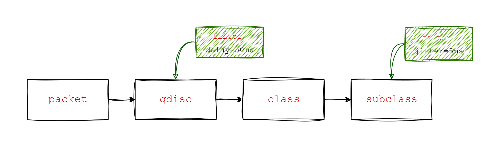

# Traffic control 

## Qdisc definition

- `qdisc`(queueing discipline) is a packet scheduler that manages the order in which packets are transmitted from a network interface

- It essentially determines how packets are queued and dequeued, influencing network performance and traffic flow. 

- The most basic qdisc is `pfifo_fast`, a simple `First-In, First-Out` queue. However, more sophisticated `qdiscs` like `htb` (Hierarchical Token Bucket) and `tbf` (Token Bucket Filter) offer more advanced traffic control capabilities. 

### htb - Hierarchical Token Bucket

- Hierarchical Token Bucket (`htb`) is a method for managing network traffic, specifically for `rate limiting` and `traffic shaping`, in Linux and other systems

- `htb` uses a tree-like structure to organize traffic into different classes. Each class can have its own rate limit and priority. 

### tbf (Token Bucket Filter)

- A Token Bucket Filter (`tbf`) is a mechanism used for traffic shaping and rate limiting in computer networks

##  Flow within classful qdiscs & classes



- When traffic enters a classful `qdisc`, it needs to be sent to any of the `classes` within - it needs to be `classified`. 
- To determine what to do with a packet, the so called `filters` are consulted. 

- The `filters` attached to that `qdisc` then return with a decision, and the qdisc uses this to `enqueue` the packet into one of the classes. 

- Each `subclass` may try other filters to see if further instructions apply. If not, the class enqueues the packet to the qdisc it contains.

## The qdisc family: roots, handles, siblings and parents

- Each `interface` has one egress `root qdisc`. 

- Each qdisc can be assigned a `handle`, which can be used by later configuration statements to refer to that qdisc. 

- Besides an `egress` `qdisc`, an `interface` may also have an `ingress`, which polices traffic coming in.

- The handles of these qdiscs consist of two parts, a major number and a minor number. It is habitual to name the root `qdisc` `1:`, which is equal to `1:0`. The minor number of a qdisc is always `0`.

- `Classes` need to have the same major number as their `parent`.

- `Packets` get `enqueued` and `dequeued` at the `root qdisc`, which is the only thing the kernel talks to

### How packets are dequeued to the hardware

A typical hierarchy might look like this:

```shell
                    root 1:
                      |
                    _1:1_
                   /  |  \
                  /   |   \
                 /    |    \
               10:   11:   12:
              /   \       /   \
           10:1  10:2   12:1  12:2
```

- When the kernel decides that it needs to extract packets to send to the interface, the `root qdisc` `1:` gets a `dequeue` request, which is passed to `1:1`, which is in turn passed to `10:`, `11:` and `12:`, which each query their siblings, and try to `dequeue()` from them. In this case, the kernel needs to walk the entire tree, because only 12:2 contains a packet.

- In short, nested classes ONLY talk to their parent qdiscs, never to an interface. Only the root qdisc gets dequeued by the kernel!

- The upshot of this is that classes never get dequeued faster than their parents allow. And this is exactly what we want: this way we can have SFQ in an inner class, which doesn't do any shaping, only scheduling, and have a shaping outer qdisc, which does the shaping.

### PRIO parameters & usage

The following parameters are recognized by `tc`:

|Parameter|Description|Default|Example|
|---------|-----------|-------|-------|
|`handle`|A unique identifier for the `qdisc`, in the format `major:`. The kernel uses this to reference the qdisc.|Required|`handle 1:`|
|`bands`|The number of priority bands (classes) to create. Each band is a separate queue.|3|`bands 4`|
|`priomap`|A map that determines how the kernel's internal packet priorities (derived from the Type of Service (TOS) field) are sorted into the bands. It's a list of 16 numbers.|`1 2 2 2 1 2 0 0 1 1 1 1 1 1 1 1`|`priomap 0 1 1 1 1 1 1 1 2 2 2 2 2 2 2 2`|
--------

- When you add new `qdisc`, you need to add a `handle`

- The `prio qdisc` with `handle 1:` will create `classes` (bands) named `1:1`, `1:2`, `1:3`, etc.

- Band 0 corresponds to class `1:1`, Band 1 to class `1:2`, and so on.

- Packets are dequeued from the lowest numbered band first. Band 0 (`1:1`) has the highest priority.

## Example usage

This command creates a prio qdisc with the `handle 1:` on the `ens33` interface. By default, it creates 3 bands (classes `1:1`, `1:2`, and `1:3`)

```shell
sudo tc qdisc add dev ens33 root handle 1: prio
```

Add a `netem` `qdisc` with a 100ms delay to the lowest priority band `1:3`

```shell
sudo tc qdisc add dev ens33 parent 1:3 handle 30: netem delay 100ms
```

Direct all SSH traffic (destination port 22) to the highest priority band `1:1`. While direct all other traffic to the lowest priority band `1:3`, which has the 100ms delay.
```shell
sudo tc filter add dev eth0 protocol ip parent 1:0 prio 1 u32 match ip dport 22 0xffff flowid 1:1

sudo tc filter add dev eth0 protocol ip parent 1:0 prio 2 u32 match ip dst 0.0.0.0/0 flowid 1:3
```

